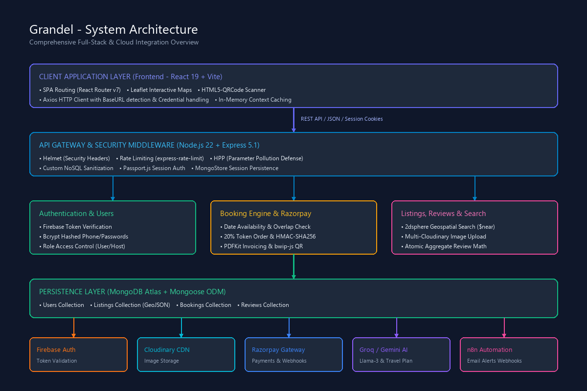

# Grandel - System Architecture

## 1. Architectural Overview

Grandel is architected as a modern, decoupled **Client-Server Single Page Application (SPA)** with an event-driven automation backend and real-time AI contextual grounding. 

The architecture balances high-performance client interactivity (instant local search, geospatial filtering, interactive maps, dynamic camera QR scanning) with resilient backend operations (cryptographic payment verification, automated multi-recipient webhook dispatch, and server-side PDF invoice generation).



> An editable source file is available at [system-architecture.drawio](system-architecture.drawio) for use with [Draw.io / diagrams.net](https://app.diagrams.net/).

---

## 2. Multi-Tier Architecture Breakdown

```
┌────────────────────────────────────────────────────────────────────────┐
│                        1. CLIENT TIER (React 19)                       │
│  - React Router v7 SPA Routing         - Leaflet & OpenStreetMap        │
│  - HTML5-QRCode Check-in Scanner      - In-Memory Cache Contexts       │
│  - Axios with BaseURL Auto-Discovery   - Mobile Responsive Bootstrap 5  │
└───────────────────────────────────┬────────────────────────────────────┘
                                    │ HTTPS / JSON / Credentials
┌───────────────────────────────────▼────────────────────────────────────┐
│                  2. API GATEWAY & SECURITY MIDDLEWARE                  │
│  - Express 5.1.0 Gateway Engine        - Helmet HTTP Security Headers   │
│  - Express-Rate-Limit (300 req/15m)    - HPP (Parameter Pollution)      │
│  - Custom NoSQL Sanitization           - Passport.js Session Handler    │
│  - MongoStore Encrypted Cookie Jars    - CORS Origin Whitelist          │
└───────────────────────────────────┬────────────────────────────────────┘
                                    │
┌───────────────────────────────────▼────────────────────────────────────┐
│                    3. DOMAIN BUSINESS LOGIC SERVICES                   │
│  ┌──────────────────────┬──────────────────────┬────────────────────┐  │
│  │     Auth Service     │  Booking & Payments  │ Property & Reviews │  │
│  │ - Firebase Admin SDK │ - Razorpay 20% Token │ - 2dsphere Geo-idx │  │
│  │ - Bcrypt Phone Hash  │ - HMAC-SHA256 Check  │ - Rating Aggregates│  │
│  │ - Password Reset Flow│ - PDFKit + bwip-js   │ - Cloudinary CDN   │  │
│  └──────────────────────┴──────────────────────┴────────────────────┘  │
│  ┌──────────────────────────────────────────────────────────────────┐  │
│  │              Node-Cache Layer (TTL: Stats, Featured, Show)       │  │
│  └──────────────────────────────────────────────────────────────────┘  │
└──────────────────┬───────────────────────────────┬─────────────────────┘
                   │                               │
┌──────────────────▼─────────────┐   ┌─────────────▼─────────────────────┐
│      4. DATA PERSISTENCE       │   │    5. EXTERNAL INTEGRATIONS       │
│  MongoDB Atlas Cluster         │   │  - Firebase Auth SDK              │
│  - Users Collection            │   │  - Cloudinary Media Storage       │
│  - Listings Collection         │   │  - Razorpay Payment Gateway       │
│  - Bookings Collection         │   │  - Groq (Llama-3.3-70B AI)        │
│  - Reviews Collection          │   │  - Google Gemini 2.5 Flash        │
│  - Sessions Collection         │   │  - n8n Automation Webhooks        │
└────────────────────────────────┘   │  - Nodemailer SMTP                │
                                     │  - OpenWeatherMap API             │
                                     └───────────────────────────────────┘
```

---

## 3. Detailed Component Specifications

### 3.1 Client Tier (Frontend)
- **Framework & Build**: React 19 bootstrapped with Vite for sub-second Hot Module Replacement (HMR) and optimized rollup production bundles.
- **Routing**: React Router v7 managing browser history, protected client routes (`/profile`, `/profile/host`, `/profile/host/scanner`), and deep query parsing.
- **Geospatial Visualization**: Leaflet integrated with React-Leaflet to render interactive pin clusters, real-time map bounds querying, and radius matching.
- **Hardware Integration**: `html5-qrcode` library accessing device media capture APIs (`navigator.mediaDevices.getUserMedia`) for in-browser QR decoding on mobile and desktop.
- **Client Cache Contexts**:
  - `ListingCacheContext`: Caches listing feeds and active filters to eliminate redundant network roundtrips.
  - `ProfileCacheContext` & `HostDashboardCacheContext`: Holds user reservation rosters and host statistics with targeted invalidation hooks on mutation.

### 3.2 Gateway & Security Layer (Middleware)
- **Express 5.1.0 Framework**: Native async error propagation and robust parameter parsing.
- **CORS Configuration**: Explicit origin whitelisting (`grandel.vercel.app`, `localhost:5173`) with `credentials: true`.
- **Security Headers**: `helmet()` protects against clickjacking, MIME sniffing, and cross-site scripting.
- **Rate Limiting**:
  - Global API Limiter: 300 requests per 15-minute window per IP.
  - Chatbot Limiter: 10 requests per minute per IP to prevent LLM quota exhaustion.
- **NoSQL Injection Sanitizer**: Custom recursive middleware scanning `req.body`, `req.params`, and `req.query` to strip any keys beginning with MongoDB operator prefix `$`.
- **Parameter Pollution**: `hpp()` flattens duplicate HTTP parameters to prevent query bypass attempts.
- **Session Layer**: `express-session` backed by `connect-mongo` storing sessions with `httpOnly: true`, `secure: true`, and `sameSite: 'none'` across cross-origin deployments.

### 3.3 Core Application Services
- **Listing Service (`controllers/listings.js`)**:
  - Handles multi-criteria faceted search (location text, category enum, capacity, dates).
  - Executes MongoDB `$near` geospatial queries using spherical geometry.
  - Multi-image upload pipeline powered by `multer` and `multer-storage-cloudinary`.
- **Booking Service (`controllers/bookings.js`)**:
  - Prevents double-booking via MongoDB date overlap range filtering (`$lt` / `$gt`).
  - Computes transparent pricing (base nights + extra guest surcharge + pet surcharge + 18% GST).
  - Enforces daily "Early Bird" 20% discounts for the first property reservation of the day.
  - Generates Razorpay 20% token deposit orders.
  - Validates Razorpay HMAC-SHA256 signatures before committing bookings.
  - Invokes `generateBookingPDF` which compiles custom vector invoices with embedded `bwip-js` QR barcodes.
- **Review Service (`controllers/reviews.js`)**:
  - Enforces review author ownership.
  - Atomically recalculates listing `avgRating` and `ratingCount` on review creation and deletion.
  - Automatically flushes Node-Cache entries for the modified listing.
- **User & Host Operations (`controllers/users.js`)**:
  - Manages dual authentication states (Firebase token exchange and Passport local credentials).
  - Generates Host Dashboard aggregate analytics (total properties, active guests, cumulative revenue, and weighted property ratings).

### 3.4 Artificial Intelligence & External Cloud Services
- **Groq Llama-3.3-70b-versatile**: Powers the platform AI Chatbot (`controllers/chatbot.js`). Injects live database listings and current user booking context into system prompts, generating instant answers and formatted `[RESERVE:{"id":...}]` action buttons.
- **Google Gemini 2.5 Flash (`services/geminiService.js`)**: Generates structured 5-attraction tourist itineraries, local food recommendations, and daily activity plans for confirmed bookings.
- **Razorpay Payments**: Financial gateway handling token checkout modals and payment state lifecycle.
- **n8n Webhook Service (`services/n8nService.js`)**: Secured with custom `X-N8N-API-KEY` headers. Dispatches lifecycle email webhooks (`guest_confirmation`, `host_notification`, `guest_thanks`).
- **Nodemailer SMTP (`services/mailService.js`)**: Direct TLS/SMTP email transport for time-sensitive account operations such as password reset tokens.
- **OpenWeatherMap (`services/weatherService.js`)**: Retrieves live temperatures, humidity, and weather conditions for booked destinations.

---

## 4. Reliability & Deployment Strategy

- **Backend Hosting**: Deployed on Render with a Node.js 22 runtime.
- **Keep-Alive Self-Ping**: Built-in 14-minute interval hitting `/api/health` prevents Render free-tier inactivity sleep (which triggers after 15 minutes).
- **Frontend Hosting**: Deployed on Vercel with automated asset caching, SPA rewrite handling, and Edge CDN distribution.
- **Database**: Cloud-hosted MongoDB Atlas with automated replication, continuous backups, and distributed secondary read preference where applicable.
