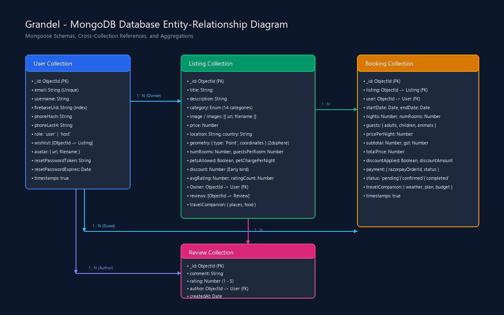

# Grandel - Database Design & Schema Specification

## 1. Overview

Grandel uses **MongoDB Atlas** as its document database, managed through the **Mongoose ODM** (v8.18.x) in Node.js. The schema design combines normalized entity references (`ObjectId` cross-references) with selective embedding (such as GeoJSON coordinates, multi-image arrays, and AI travel companion payloads) to ensure atomic write operations and query efficiency.



> An editable source file is available at [er-diagram.drawio](er-diagram.drawio) for use with [Draw.io / diagrams.net](https://app.diagrams.net/).

---

## 2. Entity-Relationship Summary

| Relationship | Type | Description |
| :--- | :--- | :--- |
| **User → Listing** | 1 : N | A user with role `host` can create and own multiple property listings (`Listing.Owner`). |
| **User → Booking** | 1 : N | A user can reserve multiple properties as a guest (`Booking.user`). |
| **Listing → Booking** | 1 : N | A listing can have multiple reservation records over time (`Booking.listing`). |
| **Listing → Review** | 1 : N | A listing maintains an array of review references (`Listing.reviews`). |
| **User → Review** | 1 : N | A user authors individual reviews (`Review.author`). |
| **User → Wishlist** | N : M | A user can bookmark multiple listings into an array of listing IDs (`User.wishlist`). |

---

## 3. Collections & Schema Specifications

### 3.1 `users` Collection (`models/user.js`)

Stores user accounts, identity mappings, security credentials, roles, and profile settings.

```javascript
const userSchema = new Schema({
    email: { type: String, required: true, unique: true },
    username: { type: String, required: true },
    firebaseUid: { type: String, unique: true, sparse: true },
    phoneHash: { type: String },
    phoneLast4: { type: String },
    role: { type: String, enum: ["user", "host", "partner"], default: "user" },
    wishlist: [{ type: mongoose.Schema.Types.ObjectId, ref: "Listing" }],
    avatar: {
        url: { type: String, default: "/images/default-user.png" },
        filename: String,
    },
    isActive: { type: Boolean, default: true },
    resetPasswordToken: String,
    resetPasswordExpires: Date,
}, { timestamps: true });
```

#### Field Specifications
- `email`: User's primary email. Unique index enforced.
- `username`: Display name across reviews, listings, and chat.
- `firebaseUid`: Unique identifier issued by Firebase Authentication; allows seamless Google OAuth and Firebase token logins.
- `phoneHash`: Salted SHA/Bcrypt hash of the user's mobile number for privacy preservation.
- `phoneLast4`: Last 4 digits of the phone number stored for display and verification without exposing the full phone number.
- `role`: Enforces RBAC permissions (`user`, `host`, `partner`).
- `wishlist`: Array of `Listing` ObjectIds bookmarked by the user.
- `resetPasswordToken` & `resetPasswordExpires`: Ephemeral crypto token and 1-hour expiry date for password reset workflows.
- **Plugins**: Enriched with `passport-local-mongoose` for automated salting, hashing, and session authentication.

---

### 3.2 `listings` Collection (`models/listing.js`)

Contains property details, geographic coordinates, pricing rules, capacity constraints, amenities, and cached ratings.

```javascript
const listingSchema = new Schema({
  title: { type: String, required: true },
  description: String,
  category: {
    type: String,
    enum: ["beach", "urban", "mountain", "castles", "pools", "forest", 
           "camping", "arctic", "lakefront", "domes", "iconic", "rooms", 
           "trending", "countryside"],
  },
  image: { url: String, filename: String },
  images: [{ url: String, filename: String }],
  amenities: { type: [String], default: [] },
  price: Number,
  location: String,
  country: String,
  reviews: [{ type: Schema.Types.ObjectId, ref: "Review" }],
  avgRating: { type: Number, default: 0, min: 0, max: 5 },
  ratingCount: { type: Number, default: 0, min: 0 },
  Owner: { type: Schema.Types.ObjectId, ref: "User" },
  numRooms: { type: Number, default: 1, min: 1 },
  guestsPerRoom: { type: Number, default: 2, min: 1 },
  petsAllowed: { type: Boolean, default: false },
  petChargePerNight: { type: Number, default: 300, min: 0 },
  discount: { type: Number, default: 0, min: 0, max: 100 },
  geometry: {
    type: { type: String, enum: ["Point"] },
    coordinates: { type: [Number] }, // [longitude, latitude]
  },
  travelCompanion: {
    places: [{ name: String, image: String }],
    food: [{ name: String, image: String }],
  },
});
```

#### Lifecycle Hooks & Indexes
- **Cascade Deletion Hook**:
  ```javascript
  listingSchema.post("findOneAndDelete", async function (listing) {
    if (listing) {
      await Review.deleteMany({ _id: { $in: listing.reviews } });
      await Booking.deleteMany({ listing: listing._id });
    }
  });
  ```
  Deleting a listing automatically cleans up all associated reviews and bookings, preventing orphaned records.
- **Geospatial Index**: `listingSchema.index({ geometry: "2dsphere" });` enables fast spherical radius search queries (`$near`).
- **Compound & Filtering Indexes**: Indexed on `category: 1`, `price: 1`, and `avgRating: -1`.

---

### 3.3 `bookings` Collection (`models/booking.js`)

Records reservations, guest party details, payment metadata, and AI-generated itinerary data.

```javascript
const bookingSchema = new Schema({
  listing: { type: Schema.Types.ObjectId, ref: "Listing", required: true },
  user: { type: Schema.Types.ObjectId, ref: "User", required: true },
  startDate: { type: Date, required: true },
  endDate: { type: Date, required: true },
  nights: { type: Number, required: true, min: 1 },
  numRooms: { type: Number, default: 1, min: 1 },
  guests: {
    adults: { type: Number, default: 1, min: 1 },
    children: { type: Number, default: 0, min: 0 },
    infants: { type: Number, default: 0, min: 0 },
    animals: { type: Number, default: 0, min: 0 },
  },
  pricePerNight: { type: Number, required: true, min: 0 },
  subtotal: { type: Number, required: true, min: 0 },
  gst: { type: Number, required: true, min: 0 },
  totalPrice: { type: Number, required: true, min: 0 },
  travelCompanion: {
    weather: {
      temp: { type: String, default: null },
      condition: { type: String, default: "" },
      humidity: { type: String, default: null },
    },
    budget: { food: String, transport: String, attractions: String, dailyTotal: String },
    plan: { type: [String], default: [] },
  },
  status: {
    type: String,
    enum: ["pending", "confirmed", "cancelled", "completed", "pending_payment"],
    default: "pending_payment",
  },
  payment: {
    razorpayOrderId: { type: String },
    razorpayPaymentId: { type: String },
    amount: { type: Number },
    status: { type: String, enum: ['pending', 'paid', 'failed'], default: 'pending' },
  },
  discountApplied: { type: Boolean, default: false },
  discountAmount: { type: Number, default: 0 },
}, { timestamps: true });
```

#### Pre-Validation Hook
```javascript
bookingSchema.pre("validate", function (next) {
  if (this.endDate <= this.startDate) {
    next(new Error("End date must be after start date"));
  } else {
    next();
  }
});
```

#### Financial Calculations Enforced
1. $\text{Base Price} = \text{nights} \times \text{pricePerNight}$
2. $\text{Extra Guest Fee} = \max(0, \text{guests} - \text{freeGuests}) \times \text{extraGuestChargePerNight} \times \text{nights}$
3. $\text{Pet Fee} = \text{animals} \times \text{petChargePerNight} \times \text{nights}$
4. $\text{Subtotal} = \text{Base Price} + \text{Extra Guest Fee} + \text{Pet Fee}$
5. $\text{GST (18\%)} = \text{round}(\text{Subtotal} \times 0.18)$
6. $\text{Total} = \text{Subtotal} + \text{GST} - \text{Discount}$
7. $\text{Token Paid (Razorpay 20\%)} = \text{round}(\text{Total} \times 0.20)$
8. $\text{Balance Due at Hotel (80\%)} = \text{Total} - \text{Token Paid}$

---

### 3.4 `reviews` Collection (`models/reviews.js`)

Stores guest reviews and ratings linked to listings.

```javascript
const reviewSchema = new Schema({
  comment: String,
  rating: { type: Number, min: 1, max: 5 },
  createdAt: { type: Date, default: Date.now },
  author: { type: Schema.Types.ObjectId, ref: "User" },
});
```

When a review is created or deleted, `controllers/reviews.js` recalculates `avgRating` and `ratingCount` on the parent `Listing` document and immediately flushes the server cache.

---

## 4. Key MongoDB Aggregations

### 4.1 Host Dashboard Aggregation (`controllers/users.js`)
Computes aggregate rating analytics for all properties owned by a host:

```javascript
const hostStats = await Listing.aggregate([
    { $match: { Owner: ownerId } },
    {
        $group: {
            _id: "$Owner",
            totalReviews: { $sum: "$ratingCount" },
            weightedSum: { $sum: { $multiply: ["$avgRating", "$ratingCount"] } },
            listingsCount: { $sum: 1 }
        },
    },
]);
```
- $\text{Aggregate Rating} = \frac{\text{weightedSum}}{\text{totalReviews}}$

### 4.2 Featured Listings Projection (`app.js`)
Retrieves top 6 featured properties with rating projection:
```javascript
const featuredListings = await Listing.find()
  .limit(6)
  .select('title image price location country reviews')
  .populate({ path: 'reviews', select: 'rating' })
  .lean()
  .exec();
```
Results are cached in `cacheService` with a 30-minute TTL (`TTL.FEATURED`).
