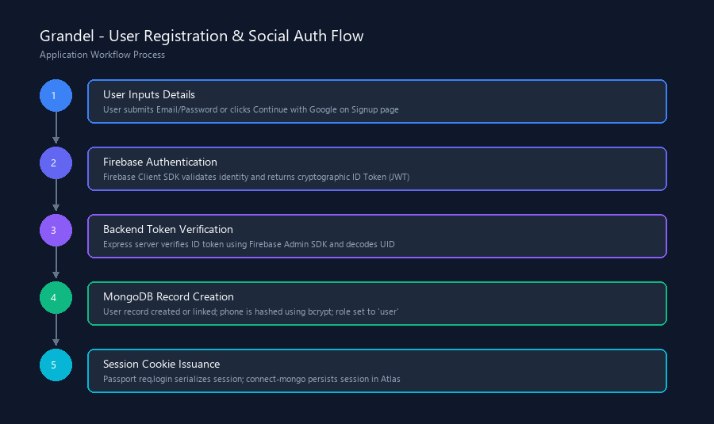
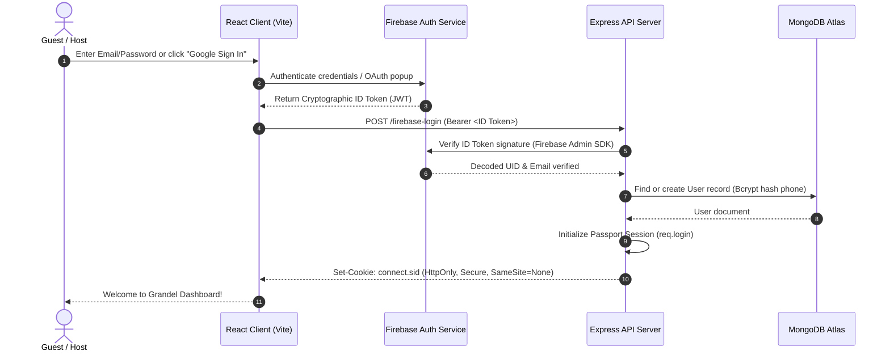
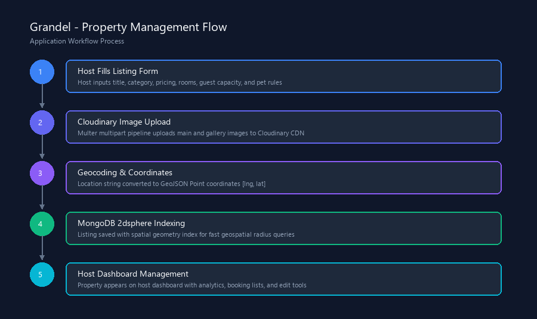
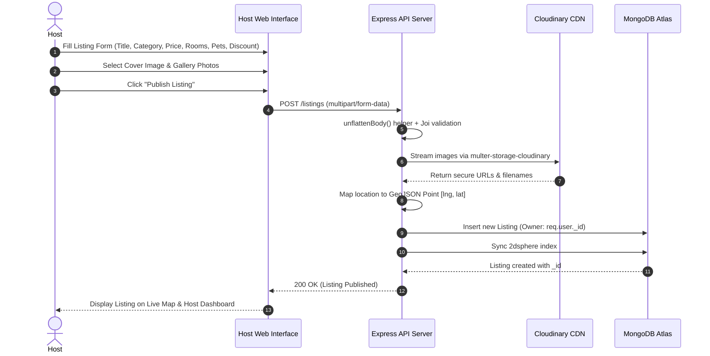
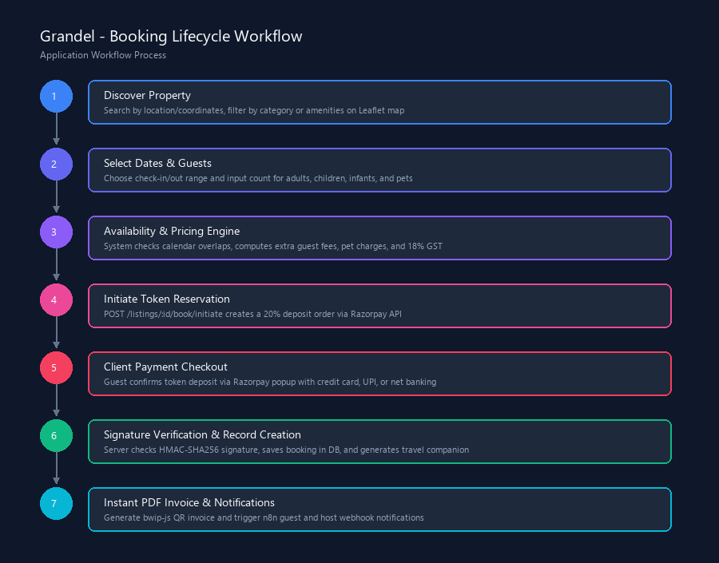
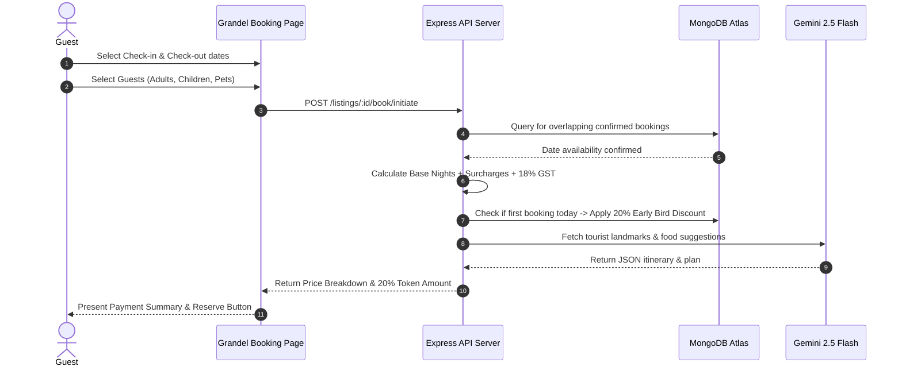
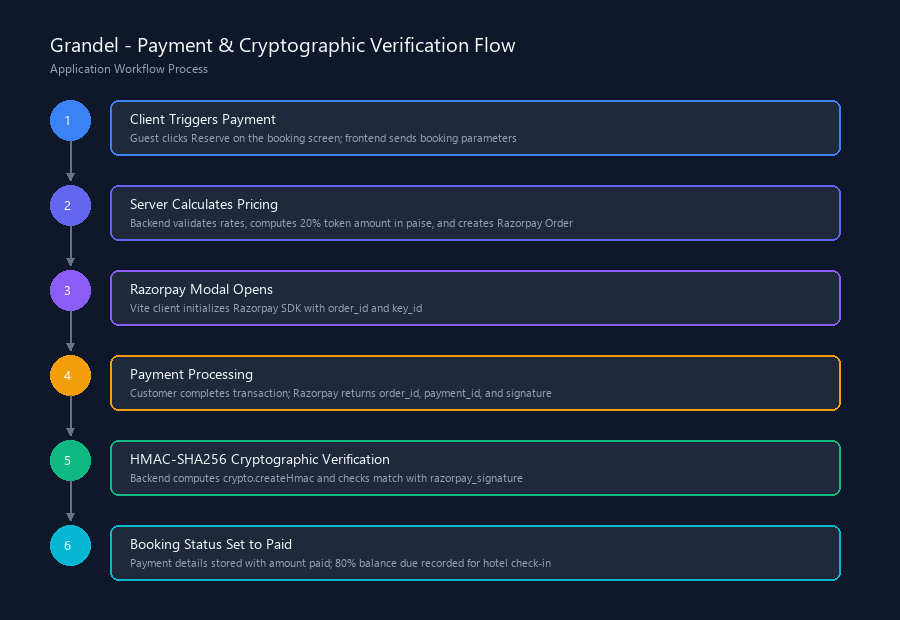
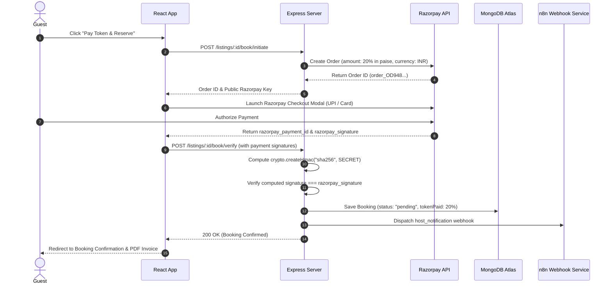
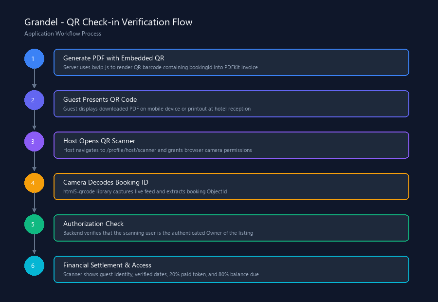
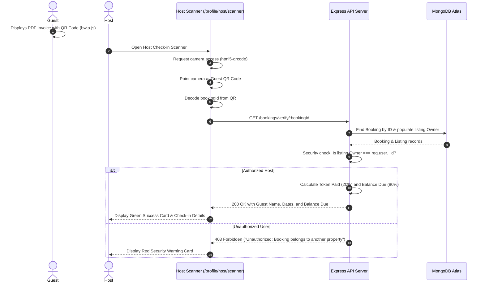

# Grandel - Project Workflow Documentation

This document visually and technically details the primary end-to-end workflows of the Grandel platform.

---

## 📑 Workflows Index
1. [User Registration & Authentication](#1-user-registration--authentication-flow)
2. [Property Creation & Management](#2-property-creation--management-flow)
3. [Booking Lifecycle & Pricing Flow](#3-booking-lifecycle--pricing-flow)
4. [Payment & Cryptographic Verification](#4-payment--cryptographic-verification-flow)
5. [QR Check-in & Host Verification](#5-qr-check-in--host-verification-flow)

---

## 1. User Registration & Authentication Flow

Covers how guests and hosts register, verify identities through Firebase, link accounts to MongoDB, and obtain secure cross-domain sessions.

---

## 2. Property Creation & Management Flow

Details the host property creation journey, multi-image Cloudinary streaming, and 2dsphere spherical coordinate indexing.

---

## 3. Booking Lifecycle & Pricing Flow

Illustrates calendar availability checks, extra guest & pet surcharges, 18% GST calculation, early bird discounts, and AI itinerary compilation.

---

## 4. Payment & Cryptographic Verification Flow

Demonstrates the 20% token deposit payment split, client-side Razorpay modal injection, and server-side HMAC-SHA256 signature verification.

---

## 5. QR Check-in & Host Verification Flow

Details the invoice generation with vector QR barcodes, mobile camera scanning, host ownership validation, and remaining balance due calculation.

